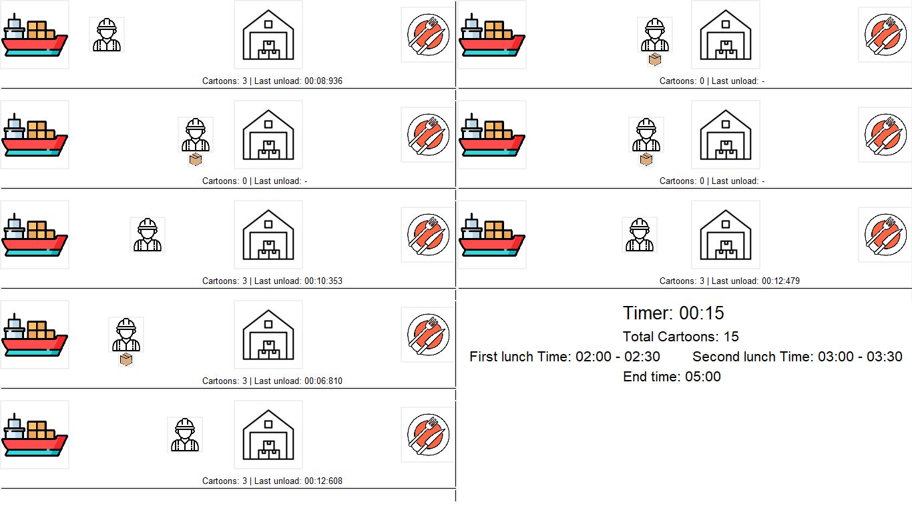
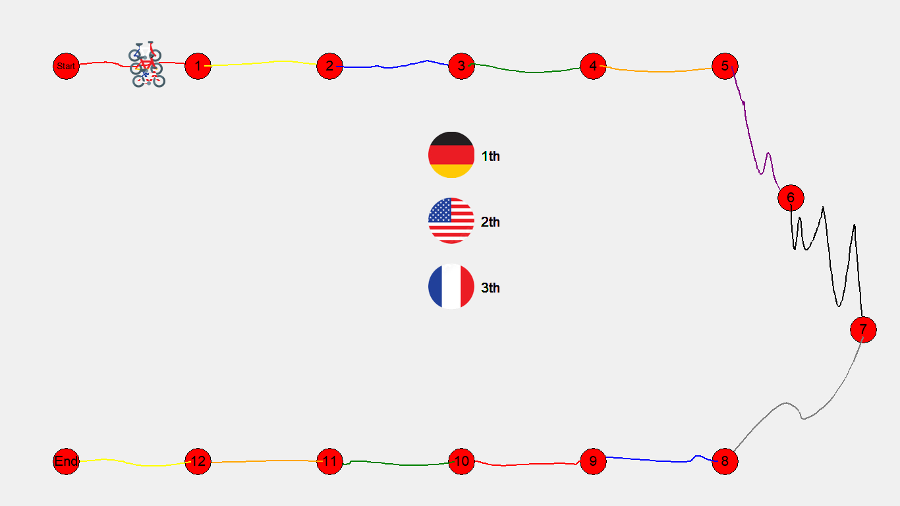

**Concurrent Computing Repository**

Welcome to the Concurrent Computing Repository! This repository is dedicated to exploring various concepts and implementations of concurrent computing. Whether you're a student, researcher, or enthusiast, this repository aims to provide valuable resources, projects, and insights into concurrent programming paradigms.

### Projects

1. **Workers Project**
   - Description: In this project, we simulate a group of workers who have specific work hours and lunch breaks. All tasks assigned to these workers are handled using multithreading to achieve concurrent execution.
   - Technologies: Python, Multithreading

2. **Tour de France Simulation**
   - Description: This project simulates the famous cycling event, Tour de France, where multiple cyclists compete in stages. The simulation is designed to run concurrently, with each cyclist being handled by a separate process.
   - Technologies: Python, Multiprocessing

### Usage

1. **Workers Project**
   - Ensure you have Python installed on your system.
   - Navigate to the directory containing `workers.py`.
   - Run `python workers.py` to execute the project.
   - Follow on-screen instructions to observe the workers' behavior during work hours and lunch breaks.

### Project Image

2. **Tour de France Simulation**
   - Python 3.x is required for running this project.
   - Navigate to the directory containing `tour.py`.
   - Execute `python tour.py` to start the simulation.
   - View the console output to track the progress of the race and each cyclist's performance.

### Project Image

### Contribution Guidelines

We welcome contributions from the community to enhance and expand this repository. If you have any suggestions, bug fixes, or new project ideas related to concurrent computing, feel free to submit a pull request. Please ensure that your contributions align with the repository's goals and follow best coding practices.

### License

This repository is licensed under the MIT License. See the `LICENSE` file for more details.

### Contact

If you have any questions, feedback, or concerns, please don't hesitate to reach out to the repository maintainer or open an issue on GitHub. Your input is highly valued and appreciated!

Thank you for visiting the Concurrent Computing Repository. Happy coding! 🚀